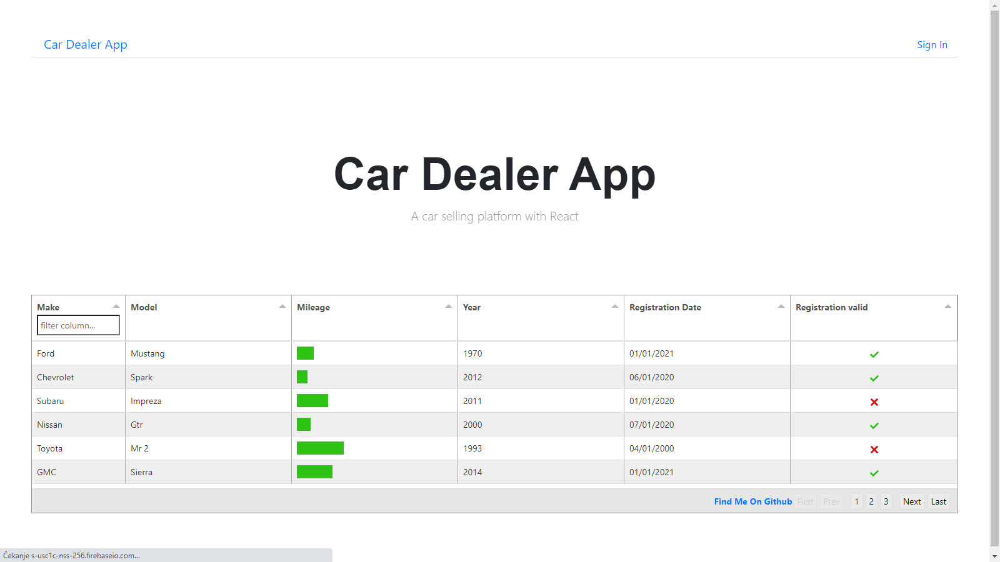
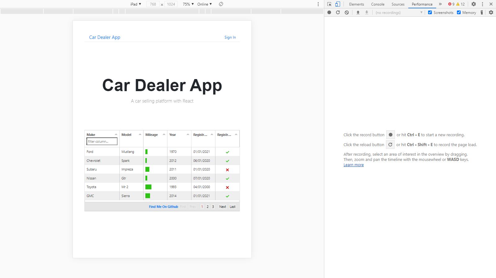
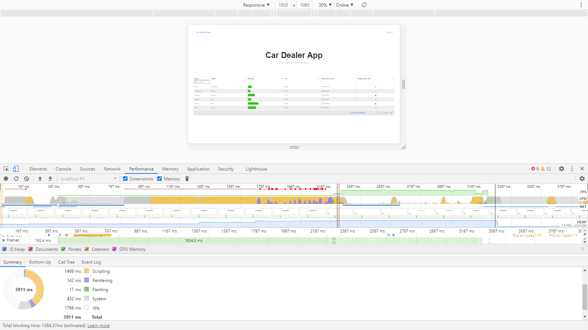
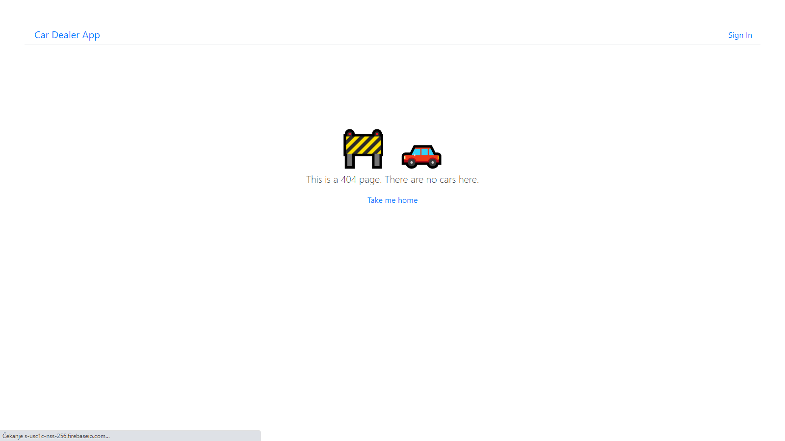

# Car Dealer App
Car dealer app with React and MobX.

	Under the hood:
-React 
https://reactjs.org
-Firebase
https://firebase.google.com
-Mobx (not yet fully implemented)
https://mobx.js.org
-Tabulator 
http://tabulator.info

	Screenshots:
	
	Homepage
	
	
	
	Responsive
	
	
	
	Performance
	
	
	
	404 Not Found Page
	
	
	

  Challenges:
-performance
-quality
-authentication

	Performance
Virtual DOM
The idea from the start was a car selling platform. To display the data in a dynamic table the emphasis was put on the frontend. And to enable the best functionality and performance the project's table uses Tabulator.

Tabulator uses a virtual DOM to enable it to process 100,000's of rows without a performance overhead.

The virtual DOM works by only building the rows that are visible on the screen. As you scroll through the table, rows are created and destroyed as they enter/leave the of the visible area of the table.

	Quality
Mobx
Mobx is not yet fully implemented. It is the only missing link in the app, but that isn't stopping it from working.

	Authentication
Firebase
Authentication was succesfully implemented with no known bugs.

